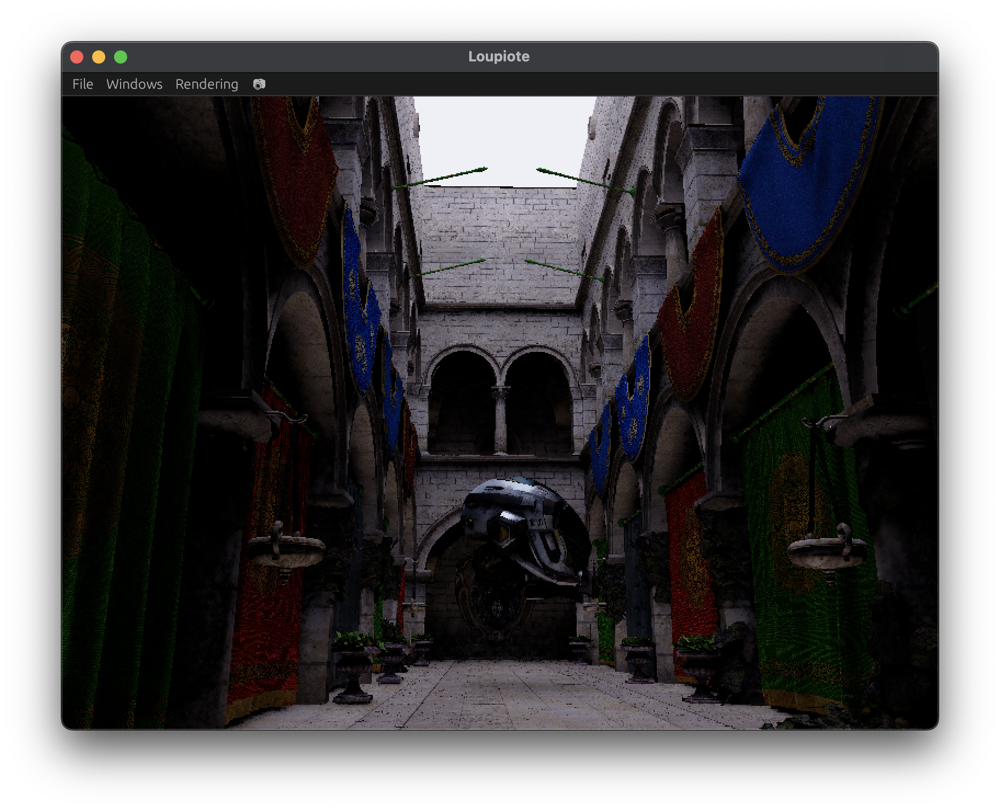
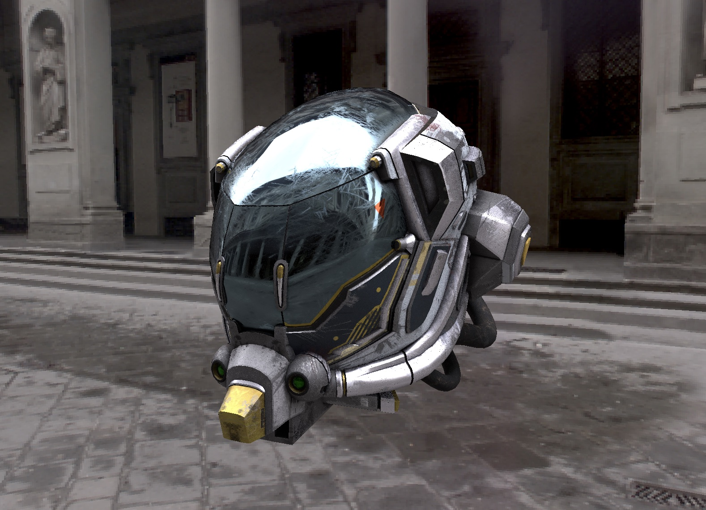

<h1 align="center">Loupiote 💡</h1>

    Interactive <strong>pathtracing</strong> library & standalone for <strong>Rust</strong> 🦀 and <strong>JavaScript</strong>!

🚧 Loupiote is a work-in-progress and might be unstable 🚧

## Features

* glTF loader
* Denoiser (SVGF)
* JavaScript API (WIP)
* Native rust code
    * Based on the [albedo](https://github.com/albedo-engine/albedo) library

## Usage

### Camera

* WASD to fly around
* Left clikc + mouse move to rotate around

## Gallery

* **Title**: *Battle Damaged Sci-fi Helmet - PBR*
* **Author**: [theblueturtle_](https://sketchfab.com/theblueturtle_)
* **License**: Creative Commons Attribution-NonCommercial

## References

* [Physically Based Rendering: From Theory To Implementation](https://pbr-book.org/)
* [Physically Based Lighting at Pixar](https://blog.selfshadow.com/publications/s2013-shading-course/pixar/s2013_pbs_pixar_notes.pdf)
* [Real Shading in Unreal Engine 4](https://blog.selfshadow.com/publications/s2013-shading-course/karis/s2013_pbs_epic_notes_v2.pdf)
* [OpenGL-PathTracer](https://github.com/RobertBeckebans/OpenGL-PathTracer)
* [three-gpu-pathtracer](https://github.com/gkjohnson/three-gpu-pathtracer)
